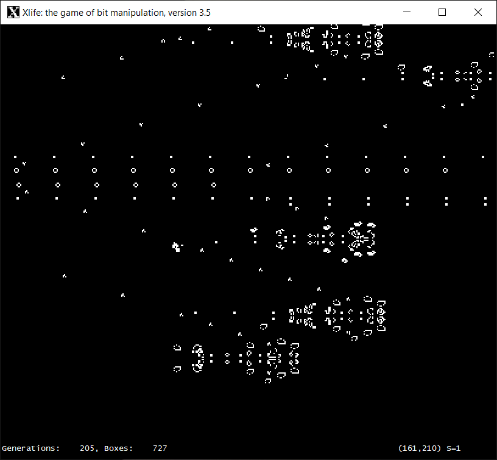

# Xlife

Xlife is a clever implementation of John Conway's 'life' cellular automata, originally written for Unix workstations back in the mid 1980s by Jon Bennett. It was one of the first implementations to try something other than a naive approach, which results in it being able to handle huge patterns on relatively modest computers, such as Bill Gosper's famous breeder pattern, which grows without limit. 

For those unfamiliar with Xlife, press 'l' to load a file (a good example is "breeder") then press 'g' to start generating. For a list of all commands, press '?'.

This is a straight port of XLife 3.5 to Microsoft Windows. No attempt has been made to modify the program to be more like a Windows application; the object of the exercise was to get XLife to compile under Windows without modifying the source code in any way. This has been achieved using a simple X11 emulation library (X11Lib) to implement enough of the X11 standard (plus a few Unix functions) to get XLife to run. 

Xlife 3.5 was written by Achim Flammenkamp, based on Paul Callahan's Xlife 3.0, which was in turn derived from Jon Bennett's Xlife 2.0. Xlife 3.5 is greatly superior to the more widely available Xlife 5.0, which is based on a different set of sources, and contains many bugs.

